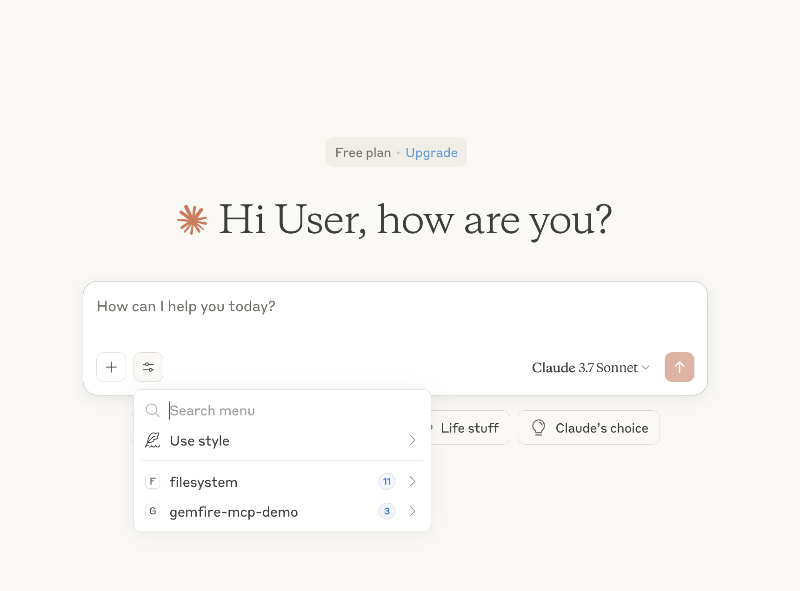

# GemFireMCPServer

A Spring Boot–based Model Context Protocol (MCP) server that uses VMware GemFire and Spring AI to enable fast, vector-based search over financial documents.

## Overview

This project demonstrates how an MCP client (like Claude Desktop) can interact with a GemFire-backed server to perform semantic search over documents. Financial files are chunked, embedded into vector representations, and stored in GemFire to support fast, intelligent querying using a Retrieval-Augmented Generation (RAG) workflow.


### Users can:

- **Upload documents** — Files are chunked, embedded, and stored as vectors in GemFire. Metadata (such as file name and size) is stored separately in a dedicated GemFire region.
- **Browse uploaded content** — Retrieve and view metadata for all stored documents.
- **Query documents (RAG)** — Submit a natural language question from an MCP client. The server performs a vector similarity search and passes the top results to the language model for response generation.

## Features

- 🔗 MCP-compliant endpoints for document ingestion, listing, and querying
- 🧠 Local, ONNX-based embeddings with Spring AI
- 💾 Vector and metadata storage in VMware GemFire
- 🧾 File metadata stored in a dedicated GemFire region
- 🔍 Fast, in-memory semantic search

---

## What You'll Need

- Java 17+
- Gradle (recommended for this demo) or Maven
- [GemFire VectorDB](https://techdocs.broadcom.com/us/en/vmware-tanzu/data-solutions/tanzu-gemfire-vector-database/1-2/gf-vector-db/install.html)
- [VMware GemFire 10.x+](https://techdocs.broadcom.com/us/en/vmware-tanzu/data-solutions/tanzu-gemfire/10-1/gf/getting_started-15_minute_quickstart_gfsh.html)
- Claude Desktop (or an MCP client)

---
## GemFire MCP Server Setup
### Setting Up Embedding with ONNX
To generate embeddings for PDF documents, Spring AI requires an embedding model. This demo uses the ONNX-exported version of `sentence-transformers/all-MiniLM-L6-v2` for local inference.

Refer to [Spring AI’s ONNX documentation](https://docs.spring.io/spring-ai/reference/api/embeddings/onnx.html#_prerequisites) for details, or follow the local setup below:

#### Steps

1. Create a virtual environment:
```
python3 -m venv venv
```
2. Activate it:
```
source ./venv/bin/activate
```
3. Upgrade pip and install build tools:
```
pip install --upgrade pip setuptools wheel
```
4. Install required packages:
```
pip install optimum onnx onnxruntime sentence-transformers
```
6. Export the model:
```
optimum-cli export onnx --model sentence-transformers/all-MiniLM-L6-v2 src/main/resources/onnx
```

This process generates a model.onnx and tokenizer.json file in resources/onnx, the location where Spring expects to load them.

### Potential issues
#### ONNX Export: Missing Dependency

If you see the following error during ONNX export:

```
Weight deduplication check in the ONNX export requires accelerate. Please install accelerate to run it.
```

Install the missing dependency:

```bash
pip install accelerate
```
---

## Clone and Build the Project
### Clone the Repository

```bash
git clone https://github.com/gemfire/gemfire-examples.git
cd extensions/gemfireVectorDatabase/gemfire-model-context-protocol-server
```

### Configure GemFire Artifact Access
To resolve GemFire dependencies, you’ll need access credentials from Broadcom.

1. Log in to the [Broadcom Customer Support Portal](https://support.broadcom.com/) with your customer credentials.
2. Go to the [VMware Tanzu GemFire](https://support.broadcom.com/group/ecx/productdownloads?subfamily=VMware%20Tanzu%20GemFire) downloads page, select VMware Tanzu GemFire, click Show All Releases.
3. Find the release named **Click Green Token for Repository Access** and click the **Token Download icon on the RIGHT**. This opens the instructions on how to use the GemFire artifact repository. At the top, the Access Token is provided. Click **Copy to Clipboard**. You will use this Access Token as the password.

#### If using Gradle
Add credentials to your ~/.gradle/gradle.properties (or project-level gradle.properties):
```
gemfireRepoUsername=EXAMPLE-USERNAME
gemfireRepoPassword=MY-PASSWORD
```
- `EXAMPLE-USERNAME` is your support.broadcom.com username.
- `MY-PASSWORD` is the Access Token you copied in step 3.

#### If using Maven:
Update your `~/.m2/settings.xml`:
```
<settings>
  <servers>
    <server>
      <id>gemfire-release-repo</id>
      <username>EXAMPLE-USERNAME</username>
      <password>MY-PASSWORD</password>
    </server>
  </servers>
</settings>
```
- `EXAMPLE-USERNAME` is your support.broadcom.com username.
- `MY-PASSWORD` is the Access Token you copied in step 3.


### Configure `application.properties`

Open the `application.properties` file and configure the following properties:

* `spring.main.web-application-type=none` — This example uses the STDIO connection with the MCP Client (Claude Desktop), so we must disable the embedded web server as it doesn't require handling HTTP requests.
* `spring.main.banner-mode=off` — Disables the application banner displayed on startup.
* `logging.pattern.console=` — Disables formatted log output to reduce console noise.
* `spring.ai.mcp.server.stdio=true` — Enables the MCP STDIO server.
* `spring.ai.vectorstore.gemfire.port=7070` — Port used by the GemFire HTTP service; must match the `--http-service-port` used by your cluster.
* `spring.ai.vectorstore.gemfire.initialize-schema=true` — Automatically creates the vector index and region in GemFire. Set to `false` if you're managing the index manually.
* `spring.ai.vectorstore.gemfire.index-name=financialDocuments` — Name of the vector index in GemFire.
* `spring.ai.embedding.transformer.onnx.model-uri=classpath:onnx/model.onnx` — Path to the ONNX model file created earlier.
* `spring.ai.embedding.transformer.tokenizer.uri=classpath:onnx/tokenizer.json` — Path to the tokenizer file created earlier.
* `spring.ai.embedding.transformer.onnx.modelOutputName=token_embeddings` — Output node name used for embeddings.
* `docs.path=/Path/To/FinancialDocs` — Directory to load financial documents from.
* `gemfire.region.docsMetadata=` - Region that will store the metatdata about each document stored in the GemFire Vector DB.

###  Build the MCP Server

```
./gradlew clean build
```
---

## GemFire Cluster Setup

Make sure you have downloaded GemFire 10.x or later and the GemFire Vector DB extension from the [Broadcom Customer Support Portal](https://support.broadcom.com/)

1. Unzip GemFire and open the directory.
2. Locate the GemFire Vector DB `.gfm` file you downloaded from the Broadcom Support Portal and move it into the `extensions` directory of your GemFire installation.  
   _This file is not included in the main GemFire download—you must download it separately._

   For example:
    ```
   vmware-gemfire-10.1.3/extensions/vmware-gemfire-vectordb-1.2.0.gfm
   ```
3. Open a terminal, navigate to the `bin` folder in the GemFire directory, and start GFSH:

    ```bash
    ./gfsh
    ```

4. In GFSH, confirm that the Vector DB extension is installed:

    ```bash
    version --full
    ```

   You should see output similar to:

    ``` 
    gfsh>version --full
    ----------------------------------------
    Tanzu GemFire
    ----------------------------------------
    Build-Java-Vendor: BellSoft
    GemFire-Source-Date: 2025-03-20 13:29:10 -0700
    Build-Platform: Linux 4.18.0-553.el8_10.x86_64 amd64
    Build-Java-Version: 1.8.0_442
    GemFire-Source-Revision: 62f20538984ebd92beee00874104d8706c6e4719
    Build-Id: gemfire 2511
    Product-Name: Tanzu GemFire
    GemFire-Version: 10.1.3
    GemFire-Source-Repository: support/10.1
    ----------------------------------------
    Tanzu GemFire Vector DB
    ----------------------------------------
    GemFire-Vector-DB-Source-Repository: HEAD
    GemFire-Vector-DB-Source-Date: 2025-04-10 09:22:32 -0700
    GemFire-Vector-DB-Version: 1.2.0
    GemFire-Vector-DB-Source-Revision: 9ad01268475449c40fd58491b373b30ce3c91522
    ```

5. Start a locator with the HTTP service enabled:

    ```
    start locator --name locator1 --http-service-port 7070
    ```

6. Start a server with a different HTTP service port:

    ```
    start server --name server1 --http-service-port 7071
    ```

7. Create a region matching the name used in your `gemfire.region.docsMetadata` property. For example:

    ```
    create region --name=FinancialDocumentsMetadata --type=PARTITION
    ```

The GemFire cluster is now ready to accept documents.

---

## Claude Desktop Setup
The GemFire MCP Server will appear as a Tool in Claude Desktop once configured.

1.Download [Claude Desktop](https://claude.ai/download)
2. Start Claude Desktop and open the Developer settings:
   `Claude -> Settings -> Developer`
3. Click on **Edit Config**
4. Open the `claude_desktop_config.json` file.
5. Add or update the `mcpServers` section as follows:


```json
{
   "mcpServers": {
      "filesystem": {
         "command": "npx",
         "args": [
            "-y",
            "@modelcontextprotocol/server-filesystem",
            "/Path/To/financialDocs"
         ]
      },
      "gemfire-mcp-demo": {
         "command": "java",
         "args": [
            "-jar",
            "/Path/To/GEMFIRE/MCP/JAR"
         ]
      }
   }
}
```

This registers two MCP servers that will appear as tools in Claude Desktop:

* **Filesystem Tool** — Enables Claude Desktop to access files in the specified directory. Be sure `/Path/To/financialDocs` matches the value of the `docs.path=` property in your application config.

* **GemFire MCP Server** — Allows Claude Desktop to interact with the GemFire cluster. The JAR path must point to the output of the `./gradlew clean build` command mentioned earlier.

6. Restart Claude Desktop.
7. When it restarts, click the **tool selector button** (next to the + button) to confirm that both tools are available (in version 0.9.3).



8. Make sure you have documents in the `financialDocuments` directory. This demo used the `Eli Lilly 2024 10K` and the `Eli Lilly May 1, 2025 10Q` documents.
---

## Using the Tools

Clicking on `gemfire-mcp-demo` in Claude Desktop will reveal three available tools:


* **add_financial_doc**  
  Claude will look for a specified document in the financialDocs directory and send it to the MCP server. The server will generate vector embeddings for the document, store them in GemFire Vector DB, and add the associated metadata to the metadata region.

* **list_available_financial_docs**  
  Claude asks the MCP server for a list of available documents. The server queries the GemFire metadata region and returns the list of documents.

* **search_financial_docs**  
  Ask Claude questions like:
  “Summarize this financial document and tell me what trends are emerging.”
  Claude will send a semantic search request to the MCP server, which retrieves the relevant content from GemFire Vector DB and responds accordingly.


### Examples
#### Add a document


#### List the available documents


#### Summarize the specified document


#### List the available documents - more than 1


#### Summarize across two documents


